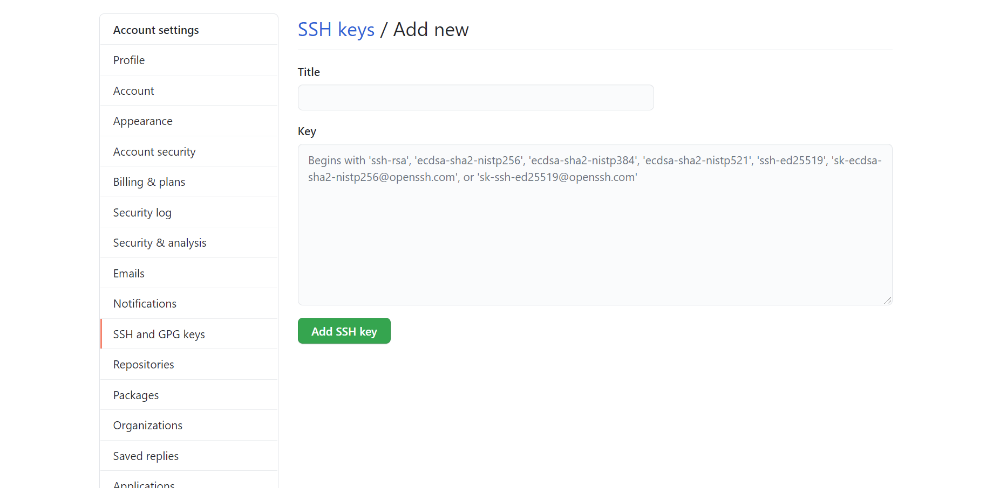
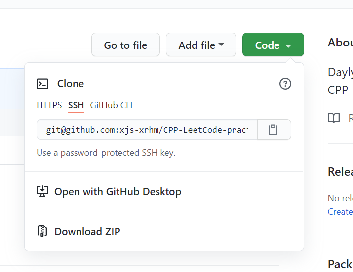
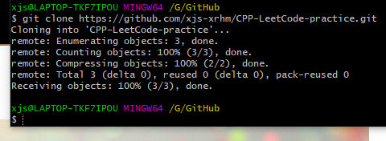
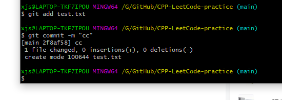

# Git 学习

## 一、初步教程

### 1.创建GitHub账号

### 2.建立自己的仓库(resposity)


### 3.建立Git与GitHub的链接

打开Git Bash界面，输入如下指令

```shell
ssh-keygen -t ras -C "你的邮箱地址"	
#之后会让你连续输入两个回车键
#能够看见密匙生成在那个目录下，之后我们去找到对应文件
```

找到密码后，在GitHub界面点击Setting->SSH;我们创建新的SSH链接。



获取我们建立仓库的地址



之后在本地建立文件夹，保存即将从GitHub克隆过来的仓库

之后我们在git bash中移动到我们想存储的位置


输入克隆指令

```shell
git clone 你自己的仓库ssh地址
```

完成后，如下(使用ssh,下图是之前使用的https，对之后上传文件不友好，血的教训！图片没有修改)



这样我们就将Github上的仓库克隆到本地了


### 4.本地文件上传

首先我们在克隆过来的仓库中新建一个文件，任意类型和名字

```shell
#我自己建立了一个test.txt文件，简单方便
$ ls
README.md  test.txt
```

下一步我们要提交这个文件

```shell
git add test.txt
```


继续执行指令

```shell
git commit -m "cc"
```



如果直接上传文件会报错

```shell
git push origin master

$ git push origin master
fatal: 'origin' does not appear to be a git repository
fatal: Could not read from remote repository.

Please make sure you have the correct access rights
and the repository exists.

```

这主要原因是我们没有建立远程连接的关系

因此我们输入建立远程连接指令

```shell
git remote add origin '输入你的仓库地址'
```

之后我们就可以上传文件了

```shell
git push -u origin master
```

如果你没开VPN的话，它会显示连接超时，这也很正常，因为Github是要外网进入。

```shell
$ git push -u origin masterfatal: unable to access 'https://github.com/xjs-xrhm/CPP-LeetCode-practice.git/': OpenSSL SSL_read: Connection was reset, errno 10054
```

打开VPN之后


我们可以看到开始上传文件了

上传成功！


### 5.坑！！！

上传文件时要注意你命令行中为名称，是master还是main

还有建立远程连接时是用的https还是ssh,最好用ssh.

```shell
#查询已建立的远程连接git remote -v#删除连接git remote remove '连接名称'
```

